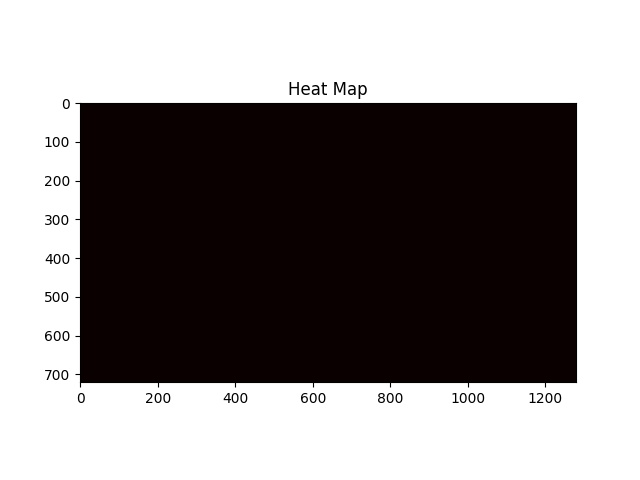
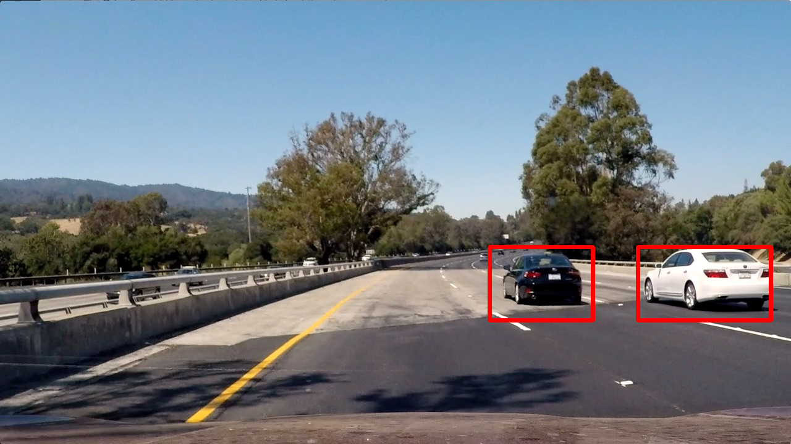
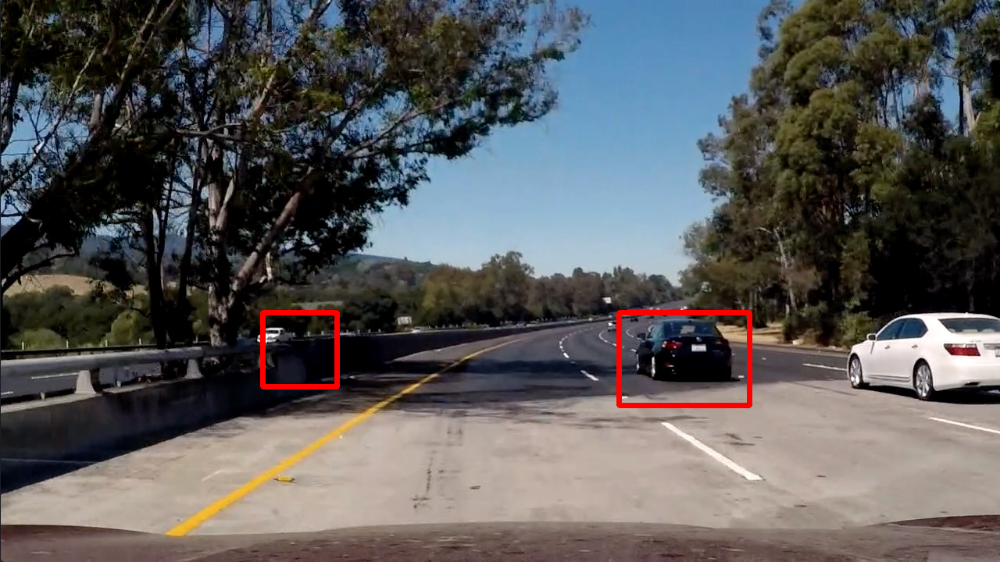
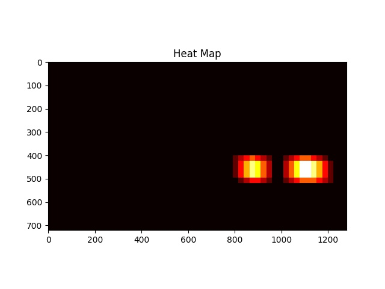

**Vehicle Detection Project**

The goals / steps of this project are the following:

* Step 1: Loading and splitting images for training and testing
* Step 2: Extracting features from training set images
* Step 3: Training classifier LinearSVM on the extracted features
* Step 4: Calculating accuracy of the model using test set images
* Step 5: Searching for vehicles by sliding window over the image and using trained model
* Step 6: Comparing new detected vehicles with the vehicles from the previous frames and merging bounding-boxes if necessary, using heatmap and boxes' areas and centers
* Step 7: Avoiding false positive bounding boxes to appear on the frames
* Step 6: Output visual display of the lane boundaries and numerical estimation of lane curvature and vehicle position.

Goals:
* Developing a robust pipeline to detect vehicles on the road

---
### 1-Data

As it was pointed out in the Tips and Tricks for The Project, dataset images are extracted from video which results in almost similar images in a sequence of frames. Even shuffling and splitting the data in a random manner causes overfitting because images in the training set may be nearly identical to images in the test set. So, I took the first `80%` of the images of each category [GTI_Far, GTI_Left, GTI_MiddleClose, GTI_Right, GTI_extracted, KITTI_extracted] as my training set, and left the `20%` of them for testing the model, this helps keeping time-series images in either training-set or testing-set and not in both to make sure train and test images are sufficiently different from one another But just out of curiosity, I implemented 2 versions for my model which I explain in Model section 3.

To add more data to the current data-set I flipped sample images under the same label to cover more case:

<table style="height: 64px; width: 319px;">
  <tbody>
  <tr style="height: 24px;">
  <td style="width: 141px; text-align: center; height: 24px;">Original Image</td>
  <td style="width: 164px; height: 24px;">Flipped Image</td>
  </tr>
  <tr>
  <td></td>
  <td></td>
  </tr>
  <tr>
  <td></td>
  <td></td>
  </tr>
  </tbody>
</table>

### 2- Features

After preparing the sets, I converted images to `YCrCb` color-space and collected 3 different sets of features including:

#### 2.1-Spatial Features

Original images size is (64, 64, 3) and contains good spatial features in each channel by showing how target object looks like, but collecting all features for all channels would generate a lot of features and slow down the classifier, yet resizing them to (32,32,3) keeps alsmot  all of the important spatial features in finding vehicles and reduces the feature-set size significantly:
 
 (code : src/features.py > bin_spatial()):

#### 2-2.Histogram Featurs

Individual histogram of the color channels is another source of information to help classifier detect structures/edges despite the variety of colors. I collected histogram features of all 3 channels. (code : src/features.py > color_hist())

#### 2-3.Histogram of Oriented Gradients (HOG)

For identifying the shape of an object I used `skimage.hog()` to extract the HOG gradient. After running a few experiments I picked theese parameter for the hog
* orientations: 9 
* pix_per_cell: (8,8), I also tried (16,16) to make model train faster , but it reduced the number of vehicle detections in my pipeline
* cell_per_block:  (2,2) I also tried (1,1) along with the (16,16) as pix_per_cell, but as mentioned in the previousl line it reduced accuracy of vehicle detection.

Here are some example using the `YCrCb` color space (channel 2) and HOG parameters of `orientations=8`, `pixels_per_cell=(8, 8)` and `cells_per_block=(2, 2)`:

<table style="width:100%">
  <tr>
    <td>Car </td>
    <td>Hog Channel 2</td>
  </tr>
  <tr>
    <td></td>
    <td></td>
  </tr>
  <tr>
    <td>Car </td>
    <td>Hog Channel 2</td>
  </tr>
  <tr>
    <td></td>
    <td></td>
  </tr>
  <tr>
    <td>Not Car </td>
    <td>Hog Channel 2</td>
  </tr>
  <tr>
    <td></td>
    <td></td>
  </tr>
  <tr>
    <td>Not Car </td>
    <td>Hog Channel 2</td>
  </tr>
  <tr>
    <td></td>
    <td></td>
  </tr>
</table>

(code: parameters are located in src/params.py, and teh feature collector modules are in src/feature.py)

### 3- Model 

I trained 2 separate models just to see how I can improve vehicle detection:

* `model1.p`, for my first model I gathered features from all of the images and used `train_test_split` to split data randomly into training-set and test-set. I then trained my LinearSVC() using YCrCB color space. Although I could see more bounding-boxes in my heatmaps, I observed a ton of false positives happening in the same wrong spot of the road sequentially! Increasing or decreasing the light in the frames just resulted in more false positives.(code : model1/model.py > collect_data())

* `model2.p`: To overcome this issue, I took the first `80%` of the images of each category [GTI_Far, GTI_Left, GTI_MiddleClose, GTI_Right, GTI_extracted, KITTI_extracted] as my training set, and left the 20% of them for testing the model, this helps keeping time-series images in either training-set or testing-set and not in both to make sure train and test images are sufficiently different from one another. (code : model2/model.py > collect_data()) & (flipping the images code: src/features.py > process_features())
 
<table style="height: 134px; width: 612px;">
<tbody>
   <tr style="height: 13px;">
   <td style="width: 83px; height: 13px;">&nbsp;</td>
   <td style="width: 277px; text-align: center; height: 13px;" colspan="2">&nbsp;model2.p (my good&nbsp;model)</td>
   <td style="width: 265px; text-align: center; height: 13px;" colspan="2">model1.p</td>
   </tr>
   <tr style="height: 59px;">
   <td style="width: 83px; height: 59px;">Samples</td>
   <td style="width: 126px; height: 59px;">
   
&nbsp;train_cars: 7302

   
&nbsp;test_cars: 1760

   </td>
   <td style="width: 151px; height: 59px;">
   
&nbsp;train_not_cars: 7174

   
&nbsp;test_not_cars: &nbsp;1794

   </td>
   <td style="width: 101px; height: 59px;">&nbsp;cars: 8792</td>
   <td style="width: 164px; height: 59px;">&nbsp;not_cars: 8968</td>
   </tr>
   <tr style="height: 13px;">
   <td style="width: 83px; height: 13px;">Train set</td>
   <td style="width: 126px; height: 13px;">&nbsp;X_train: 28412</td>
   <td style="width: 151px; height: 13px;">&nbsp;y_train : 28412</td>
   <td style="width: 101px; height: 13px;">&nbsp;X_train:28416</td>
   <td style="width: 164px; height: 13px;">&nbsp; y_train:28416</td>
   </tr>
   <tr style="height: 13px;">
   <td style="width: 83px; height: 13px;">Test set</td>
   <td style="width: 126px; height: 13px;">&nbsp;X_test: 3554</td>
   <td style="width: 151px; height: 13px;">&nbsp;y_test : 3554</td>
   <td style="width: 101px; height: 13px;">&nbsp;X_test: 7104</td>
   <td style="width: 164px; height: 13px;">&nbsp;y_test:7104</td>
   </tr>
   <tr style="height: 13px;">
   <td style="width: 83px; height: 13px;">&nbsp;Accuracy</td>
   <td style="width: 126px; height: 13px;" colspan="2">0.9899</td>
   <td style="width: 101px; height: 13px;" colspan="2">0.993</td>
   </tr>
   <tr style="height: 13px;">
   <td style="width: 83px; height: 13px;">Training time</td>
   <td style="width: 126px; height: 13px;" colspan="2">36.92 sec</td>
   <td style="width: 101px; height: 13px;" colspan="2">43.65 sec</td>
   </tr>
   <tr style="height: 13px;">
   <td style="width: 83px; height: 13px;">Prediction Time for 100 label</td>
   <td style="width: 126px; height: 13px;" colspan="2">0.0006 sec</td>
   <td style="width: 101px; height: 13px;" colspan="2">0.0008 sec</td>
   </tr>
   <tr style="height: 13px;">
   <td style="width: 83px; height: 13px;">Feature Vector Length</td>
   <td style="width: 126px; height: 13px;" colspan="2">8460</td>
   <td style="width: 101px; height: 13px;" colspan="2">8460</td>
   </tr>
   </tbody>
</table>

models are placed into 2 separated directories :
* model1/ [model.py, model.p pipepline.py, output_images, project_output.mp4]
* model2/ [model.py, model.p pipepline.py, output_images, project_output.mp4] **selected model**

Here is just comparison of flase positives at 00:08 sec for both models, model1 detects this false box for `8 consecutive` frames while model2 is doing much better, which convinced me that model2 shoudl perform better in detecting vehicles overall

<table style="width:100%">
  <tr>
    <td>Frame</td>
    <td>model1</td>
    <td>model2</td>
  </tr>
  <tr>
    <td>1</td>
    <td></td>
    <td></td>
  </tr>
  <tr>
    <td>2</td>
    <td></td>
    <td></td>
  </tr>
  <tr>
    <td>3</td>
    <td></td>
    <td></td>
  </tr>
  <tr>
    <td>4</td>
    <td></td>
    <td></td>
  </tr>
</table>

### 4- Pipeline & Video Implementation

#### 4-1 Sliding Window Search

For each image, I extract the Hog features of the lower_half of the image once to save time, and use sub_sampling to get all of its overlaying windows. Each window is defined by a scaling factor where a scale of 1 would result in a window that's 8 x 8 cells  that is 64 as the orginal sampling rate, with 8 cells and 8 pix per cell.

Then for each block sub_sample I extract hog_features from the main hog_feature list and also collect color and historam feature, for normalizing my feature vector I used `StandardScaler()` and transformed image features. After normalizing the features for the block, I pass them to my classifier and get the predition and add the detections to a bounding_box list and move on to the next block.

(code src/utils > find_cars())

### 4-2 Drawing boxes:

I used heatmaps to separate good boxes from false positives by iterating thorugh bounding_box list and incrementing the value of overlapping detections. By applying a threshold of `1` I was able to remove some of the false positives, but not all of them.

<table style="width:100%">
  <tr>
    <td>test image </td>
    <td>Heatmap</td>
    <td>Detections</td>
  </tr>
  <tr>
    <td></td>
    <td></td>
    <td></td>
  </tr>
  <tr>
    <td></td>
    <td></td>
    <td></td>
  </tr>
  <tr>
    <td></td>
    <td></td>
    <td></td>
  </tr>
  <tr>
    <td></td>
    <td></td>
    <td></td>
  </tr>
  <tr>
    <td></td>
    <td></td>
    <td></td>
  </tr>
</table>

So I added a `Vehicle class` to my code in order to cache previous frames' bounding_boxes and do more improvements on my false positive correction. For each bounding_box, I create a vehicle object and get the center of the box, then I iterate thorugh my cached vehicles to find any matches of my existing vehicle with these new coordinates. Here are the 2 conditions to satisfy:

* 1- covers_range1: if this new vehicle is in the range of +/-25 px of exisiting vehicles
* 2- covers_range2: if this new vehicle ((topx,topy), (bottomx,bottomy)) area covers any of the existing vehicles or vice versa

if the new vehicle falls into any of these conditions , I merge their bounding_boxes by getting the mean of their top & bottom cooridanates and incerement the vehicle appearance counter and also keep its old counter to do more filtering in the upcoming frames.

if conditions didn't apply to the new vehicle or if the cache is empty, I just create new vehicle objects and append them to my vehicles cache. 

As my next filtering step, I check the old_counter and the current_counter :

 * if it's the first appearance of the vehicle (current_counter=0) I don't draw it (not removing it from my cache) but keep it in my cache to detect a 2nd appearance in the next frame. If in the next frame its counter increased, it's a sign that this detection should be a vehicle (not always true but if my classifier improves by more images I'm more confident it's a good condtion).
 * if it's not the first appearance:
 
   1- if its old_counter is equal to the current_counter, it means the vehicle is not being picked by my classifier anymore. I still give it a 2nd chance and wait for 1 more frame to check if the vehicle is going out of sight or maybe it was a false positive at first hand. In order to track update state, I added a not_updating counter in each vehicle object. 
   
   2- if the not_updating counter is bigger than 1 , meaning that the detection is not happening in 2 consecutive frames, I decrement its current_counter by 2, as a safety step. Doing so helps me to keep the cars that have appeared in 100 frames even more in track, however by decrementing their counters I'm making it more flexible for smooth removal of these cars from the frames.
   
   3- if the car not_updating counter is more than 2 and its current_counter is 0, it's a good candidate for removal from cache.
   
   4- and the the last case is a good car ! its counter is incrementing and it's more likely to appear in the next frames.

(code: src/Vehicle.py & src/utils > draw_labeled_bboxes() )

Here's a [link to my video result](./project_output.mp4)

Here's a [link to my lane_line detection combined with vehicle_detection video result](./project_combined_output.mp4)

---

### Discussion

* 1- More data is needed, there is no vehicle sample of motorbikes or any other types of vehicles 
* 2- This data is not covering all road conditions such as night/rainy roads
* 3- Traffic situations with multiple vehicles requires very fast detection, while model is relativly slow comparing to realtime processing cases and accurate actions to slow down car or change direction.
